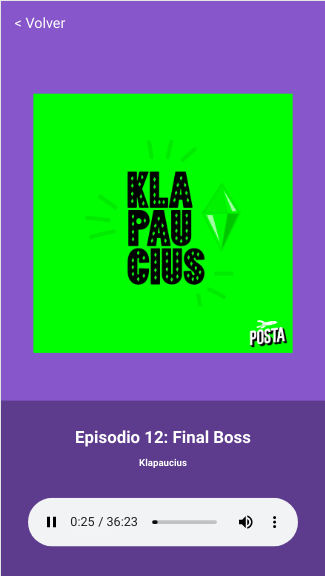

# App de podcasts de platzi

Esta es una aplicación desarrollada en Next.js la cuál se conecta con el API https://api.audioboom.com para reproducir Podcast

## ¿Como probarla?

Require Node.js 12

* `npm i` Para intalar las dependencias
* `npm run dev` Para el entorno de desarrollo
* `npm run build && npm run start` Para el entorno de producción

## Licencia

MIT
